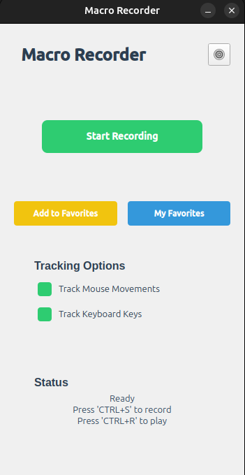
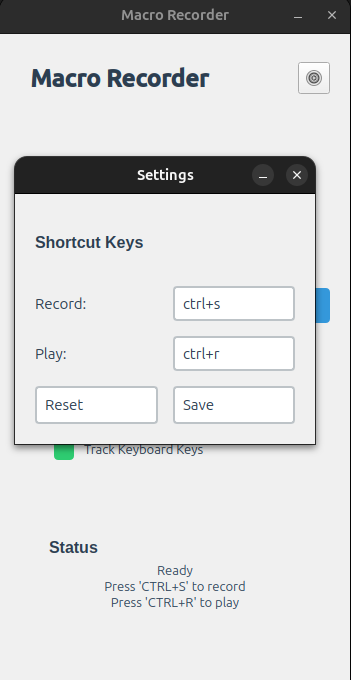
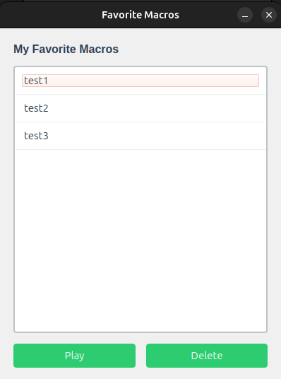

# TinyTask - Macro Recorder

<div align="center">
  
  
</div>
<div align="center">
  
</div>

TinyTask is a lightweight macro recorder that allows you to record and replay mouse movements and keyboard actions. It's built with PyQt6 and provides a modern, user-friendly interface.

## Libraries Used

- **PyQt6** (v6.4.2): Modern GUI framework for Python, providing a comprehensive set of widgets and tools for creating desktop applications.
- **pynput** (v1.7.6): Cross-platform library for controlling and monitoring input devices (mouse and keyboard).

## Features

- Record mouse movements and clicks
- Record keyboard actions
- Save favorite macros
- Customizable shortcut keys
- Modern and intuitive interface
- Cross-platform support (Windows and Debian-based Linux distributions)
- Available as portable executable or system installer

## Installation

### Pre-built Packages

#### Windows

1. Download [`TinyTask-Setup.exe`](builds/TinyTask-Setup.exe) from the builds directory
2. Run the installer and follow the installation wizard
3. Launch TinyTask from the Start Menu or Desktop shortcut

#### Debian-based Linux (Ubuntu, Linux Mint, Pop!\_OS, etc.)

1. Download [`tinytask_1.0.0_amd64.deb`](builds/tinytask_1.0.0_amd64.deb) from the builds directory
2. Install using:

```bash
sudo dpkg -i tinytask_1.0.0_amd64.deb
```

3. Launch TinyTask from your applications menu or run `tinytask` in terminal

### Portable Version

Download the appropriate portable version from the builds directory:

- Windows: [`TinyTask-portable-windows.exe`](builds/TinyTask-portable-windows.exe)
- Linux: [`TinyTask-portable-linux`](builds/TinyTask-portable-linux) (Tested on Debian-based distributions)

For Linux:

```bash
cd builds
chmod +x TinyTask-portable-linux
./TinyTask-portable-linux
```

For Windows, download and run the .exe file directly.

### Building from Source

1. Clone the repository:

```bash
git clone https://github.com/yourusername/TinyTask.git
cd TinyTask
```

2. Create a virtual environment (optional but recommended):

```bash
python -m venv venv
source venv/bin/activate  # On Linux/Mac
# or
venv\Scripts\activate  # On Windows
```

3. Install dependencies:

```bash
pip install -r requirements.txt
```

4. Run the application:

```bash
python src/main.py
```

5. For Debian-based distributions, build and install the .deb package:

```bash
python build.py installer
sudo dpkg -i builds/tinytask_1.0.0_amd64.deb
```

## Building Executables

The project includes a build script that can create both portable executables and system installers. Built packages will be placed in the `builds` directory.

### Prerequisites

#### Windows

- Install NSIS (Nullsoft Scriptable Install System) from https://nsis.sourceforge.io/

#### Debian-based Linux

- Install dpkg-deb:

```bash
sudo apt-get install dpkg
```

### Build Commands

1. Create portable executable:

```bash
python build.py portable
```

2. Create system installer:

```bash
python build.py installer
```

3. Create both portable and installer versions:

```bash
python build.py all
```

## Usage

1. Default shortcuts:

   - Press 'R' to start/stop recording
   - Press 'S' to play the last recorded macro

2. Features:
   - Enable/disable mouse and keyboard tracking
   - Save frequently used macros as favorites
   - Customize shortcut keys in settings

## License

This project is licensed under the GNU Lesser General Public License v3.0 (LGPL-3.0). See the [LICENSE](LICENSE) file for details.

The LGPL-3.0 allows you to:

- Use the software for commercial purposes
- Modify the software and create derivative works
- Distribute copies and modifications
- Use the software privately

While requiring you to:

- Include the original copyright notice
- Disclose the source code of your modifications
- License modifications under LGPL-3.0
- State significant changes made to the software
